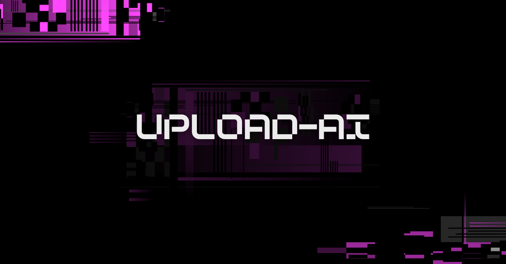

<h1 align="center">
  
</h1>

<div id='introducao'>

O **upload-ai** é uma aplicação que possibilita realizar upload de vídeos e por meio de IA, criar automaticamente títulos chamativos e descrições com um boa indexação.
</div>

## Tópicos

* [Introdução](#introducao)
* [Instalar e rodar o projeto localmente](#instalacao)
* [Stack utilizada](#stack_utilizada)
* [Contatos](#contatos)

<div id='instalacao'>

## Instalando e rodando o projeto localmente:

Para rodar o **upload-ai** em sua máquina é bem simples.

Você precisa ter instalado:

- Node.js v18
- Npm, yarn ou pnpm para a instalação dos pacotes (projeto desenvolvido com pnpm)

Para a instalação dos pacotes você deve entrar em cada pasta individualmente
e rodar o comando `pnpm`, pois neste projeto temos o _backend_ e o _frontend_.

Navegue para `../api` e rode no terminal o comando:
```bash
pnpm i
```
Repita esse passo para `../web`.

<div id='stack_utilizada'>
<h2>Stack utilizada</h2>

**Back-end:**
- Prisma
- Fastify
- Zod
- OpenAI
- Dotenv
- Typescript

**Front-end:**
- Vite
- React
- TypeScript
- TailwindCSS
- Shadcn/UI
- ESLint
- Lucide Icons

</div>

<div id='contatos' align="center">
  <p align="center">Made with 💜 by Mateus Jesus</p>
  <div id="contatos" align="center">
    <a href="https://www.linkedin.com/in/mateus-jesus/" target="_blank"></a>
</div>